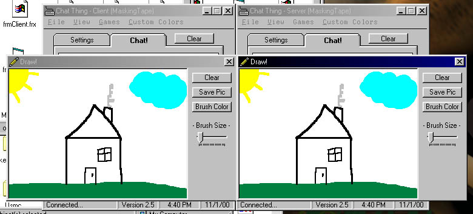



## Chat Thing 2\.5

### Description

This is a 1 on 1 chat program that has a few neat features: 2 games to play (Tic Tac Toe and Rock Scissors Paper) a drawing program (which is new in this version) among a few other things. About the drawing section, it may or may not work for you so don't yell at me! :-) Please vote if you like/hate it.
 
### More Info
 

             |
---                |---
**Submitted On**   |2000-11-01 16:44:50
**By**             |[MaskingTape](https://github.com/Planet-Source-Code/PSCIndex/blob/master/ByAuthor/maskingtape.md)
**Level**          |Beginner
**User Rating**    |4.8 (24 globes from 5 users)
**Compatibility**  |VB 6\.0
**Category**       |[Internet/ HTML](https://github.com/Planet-Source-Code/PSCIndex/blob/master/ByCategory/internet-html__1-34.md)
**World**          |[Visual Basic](https://github.com/Planet-Source-Code/PSCIndex/blob/master/ByWorld/visual-basic.md)
**Archive File**   |[CODE\_UPLOAD1157611112000\.zip](https://github.com/Planet-Source-Code/maskingtape-chat-thing-2-5__1-12706/archive/master.zip)

